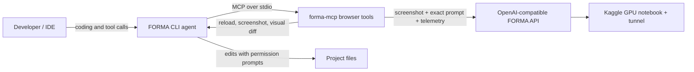

# FORMA

**A coding agent with eyes on the interface.** FORMA pairs a coding model that can edit your project with a fine-tuned visual auditor that inspects screenshots and measured browser context. Its standalone MCP server also works with other MCP-capable coding CLIs and IDEs.

FORMA targets developers and vibe coders who can get a page running but want a useful loop for finding and fixing visual, responsive, accessibility, and interaction issues.

> **Early build:** the code and Kaggle serving options are being validated. The endpoint uses a time-limited Kaggle session and a public tunnel; keep the bearer token private and shut down the notebook when finished.

## What it does

- Opens real pages in Chromium at desktop, tablet, and mobile sizes.
- Captures screenshots, console errors, crashes, failed requests, fonts, overflow, tap-target measurements, image alt coverage, and performance signals.
- Runs optional axe-core and Lighthouse checks, plus tools for headings, visual weight, spacing, contrast, computed styles, image tiles, annotations, and visual diffs.
- Sends a screenshot and the training-compatible browser-context prompt to FORMA, the Qwen2.5-VL adapter. FORMA is an audit tool; it does not coordinate other tools or write code.
- Leaves coding decisions to the orchestrator you select: a compatible hosted model or a local Ollama model.
- Runs as a standalone Node.js terminal agent with file search/editing, shell, planning, sessions, and context management.

The model was trained on single-turn UI/UX audits with images resized to a maximum side of **512 px**. MCP resizes audit images to that same limit. For fine details, use `slice_image` and audit the resulting tiles.

## How it works



FORMA’s prompt input follows the training row: the `user_prompt` text from `dataset/entries.jsonl`, followed by two newlines, `Browser context (measured, authoritative — trust these over visual estimates):`, another newline, and JSON-serialized telemetry. The coding model can keep source-code context in its own conversation, but source code is not injected into the VLM prompt.

## Quickstart

### 1. Start the model in Kaggle

1. Add the final adapter directory as a Kaggle notebook input. It must contain `adapter_config.json`, `adapter_model.safetensors`, and the companion tokenizer/processor files.
2. Open `server/forma_server_kaggle.py` and paste its full contents into **one Kaggle notebook cell**.
3. Enable the two-T4 GPU accelerator and run the cell. If Cloudflare quick tunnel cannot start, add `NGROK_AUTHTOKEN` as a Kaggle secret for the fallback.
4. Copy the printed `URL` and `TOKEN`. The URL is the API address; the token is the bearer credential. The URL changes after notebook restarts, and Kaggle sessions are time-limited.

The cell tries these backends in order: merged fp16 weights served by vLLM with tensor parallelism 2; vLLM bnb-4bit plus LoRA; then a FastVisionModel/Transformers generation path. The notebook log names the selected backend and records failed attempts. **Only the non-GPU parts can be checked in a standard development environment; confirm the selected backend on the target Kaggle T4 session.**

### 2. Install the CLI

Requires Node.js 20 or newer and npm. After the first tagged GitHub Release is published:

```sh
curl -fsSL https://raw.githubusercontent.com/EgoisticCoder/Forma/main/install.sh | sh
```

Direct package installation works after the workspaces are published to npm:

```sh
npm install --global @forma-ai/forma @forma-ai/forma-mcp
```

On Windows, run `irm https://raw.githubusercontent.com/EgoisticCoder/Forma/main/install.ps1 | iex` in PowerShell. Until the first GitHub Release is published, clone the repository and run `npm install` followed by `npm run build:cli`. Chromium installs the first time browser tools start. Choose an OpenAI-compatible coding provider such as Groq/OpenAI or a local Ollama model during setup.

### 3. Connect and audit

```sh
forma
```

On first run, enter the Kaggle URL and token, then the coding model’s OpenAI-compatible base URL, API key, and model ID. For local Ollama, the default endpoint is `http://localhost:11434/v1`; use an installed model such as `qwen2.5-coder:14b`. Local inference has no model API charge, though it uses your machine’s resources.

The private config is saved at `~/.forma/config.json` with mode `0600`. You can also configure via:

```sh
forma --url https://your-tunnel.trycloudflare.com --token YOUR_BEARER_TOKEN
FORMA_URL=https://your-tunnel.trycloudflare.com FORMA_TOKEN=YOUR_BEARER_TOKEN forma
forma config
forma config show   # credentials are redacted
```

Run a non-interactive audit and save Markdown plus JSON:

```sh
forma audit https://example.com
```

For a local site, FORMA asks before allowing the browser to reach the private host:

```sh
forma audit http://localhost:3000
```

In an interactive coding session, ask the agent: **“Audit this page and fix what you find.”** It can use the browser tools, make code edits after approval, reload, capture a new screenshot, and compare before/after results.

## OpenAI-compatible endpoint

The Kaggle URL serves `/v1/chat/completions` and `/v1/audit`. The endpoint accepts only base64 image data URLs; it does not fetch arbitrary image URLs. Requests require `Authorization: Bearer <TOKEN>`.

```sh
curl https://YOUR-KAGGLE-TUNNEL/v1/chat/completions \
  -H 'Authorization: Bearer YOUR_TOKEN' \
  -H 'Content-Type: application/json' \
  -d '{"model":"forma","temperature":0.2,"max_tokens":1200,"messages":[{"role":"user","content":[{"type":"text","text":"You are a professional UI/UX auditor. Analyze the attached website screenshot and produce a structured audit. First reason about it step by step inside a think block, then output the final JSON report as specified in your instructions.\n\nBrowser context (measured, authoritative — trust these over visual estimates):\n{}"},{"type":"image_url","image_url":{"url":"data:image/jpeg;base64,BASE64_IMAGE_HERE"}}]}]}'
```

OpenAI Python SDK users can set `base_url="https://YOUR-KAGGLE-TUNNEL/v1"` and `api_key="YOUR_TOKEN"`, then call `client.chat.completions.create(model="forma", ...)`. FORMA only performs its trained audit task; it does not provide coding-model tool calls.

## MCP toolbox reference

Run the server directly with stdio:

```sh
FORMA_URL=https://YOUR-KAGGLE-TUNNEL FORMA_TOKEN=YOUR_TOKEN npx -y @forma-ai/forma-mcp
```

Configure any MCP-compatible coding CLI or IDE to launch `forma-mcp` over stdio and pass `FORMA_URL` and `FORMA_TOKEN` in its environment. Keep credentials in the client’s secret store when available. A copy-ready set of IDE examples is in [`docs/mcp.md`](docs/mcp.md).

| Tool | Purpose |
|---|---|
| `browser_open` | Navigate to a URL at desktop, tablet, or mobile size; private hosts require opt-in. |
| `screenshot` | Capture full page, viewport, or selector to `.forma/artifacts/`. |
| `capture_telemetry` | Return the `scrap.py` DevTools report schema. |
| `console_logs`, `network_failures` | Inspect console, crashes, failed requests, and HTTP errors. |
| `lighthouse`, `axe_scan` | Run Lighthouse and axe-core. |
| `dom_hierarchy`, `visual_hierarchy` | Inspect headings, landmarks, reading order, nesting, and visual weight. |
| `measure_spacing`, `contrast_scan`, `tap_target_scan`, `computed_styles` | Inspect rhythm, WCAG contrast, control dimensions, and CSS computed values. |
| `slice_image`, `annotate_image`, `visual_diff` | Tile, annotate, and compare screenshots. |
| `forma_audit` | Call the protected model with the dataset-format prompt and validate the result. |

Artifacts are saved under the active project’s `.forma/artifacts/`; reports are saved under `.forma/reports/`. Browser captures may contain page content, so keep these folders out of public repositories.

## Permissions and privacy

- FORMA asks before shell commands, file edits, and browser MCP tools. It previews diffs before applying edits and supports per-tool allow/deny rules.
- Browser navigation to localhost/private IP space is blocked until you explicitly opt in.
- `.env*` and `secrets/` paths are denied to the coding model by default; shell commands still require approval.
- The Kaggle server requires a random bearer token for every endpoint, closes CORS, rate-limits per IP, and accepts base64 images rather than remote URL fetches.
- No Forma product telemetry or accounts are implemented. Model providers receive the prompt and context you choose to send; do not include secrets in prompts.
- The config file stores API credentials. It is local, permission-restricted, and redacted by `forma config show`; protect your OS account. `forma uninstall` removes the packages and leaves this config in place; remove `~/.forma` explicitly if you also want to delete saved credentials.

## Evaluation and limitations

`forma eval ./screenshots --entries dataset/entries.jsonl --labels dataset/labels.jsonl` reports schema validity, issue-count range, score-key coverage, category/severity overlap, repeated/generic summaries, numeric evidence, and heuristic contradictions against saved telemetry. A direct `--ground-truth` file can also be supplied when each row includes an image path and answer. It cannot establish model quality from a small sample; use unseen pages, independently reviewed labels, and a larger set before making performance claims.

The fine-tuned model is a visual auditor, not an autonomous coding model. Screenshot judgments can be wrong or generic; telemetry and DOM tools provide measurable checks, not perfect ground truth. Kaggle quick tunnels are temporary and have no production availability guarantee. Local host opt-in should only be used for servers you own.

## Project map

- `server/forma_server_kaggle.py` — one-cell Kaggle API server and tunnel bootstrap.
- `packages/forma-mcp/` — reusable stdio MCP browser and UI/UX tools.
- `packages/forma-cli/` — standalone `forma` agent, setup, audit, and eval commands.
- `website/` — Vercel landing page for developers and vibe coders.
- `pitch-deck/` — browser-presentable, printable investor deck and source notes.
- `docs/` — MCP integration, model summary, and operating guides.

## Development

```sh
npm install
npm run build:mcp
npm run build:cli
npm run build:website
npm run test:mcp
```

The MCP fixture test uses a local page containing known mobile overflow, missing alt text, low contrast, small text, an undersized button, and a console error.

## Website deployment

Import the repository into Vercel and set the **Root Directory** to `website`. Vercel detects Next.js automatically; no environment variables are required. The install links point to the GitHub repository. Replace them with the production release page once tagged artifacts are published.

## Short description

> Open-source coding agent with a fine-tuned visual auditor and browser-based UI/UX debugging tools.
